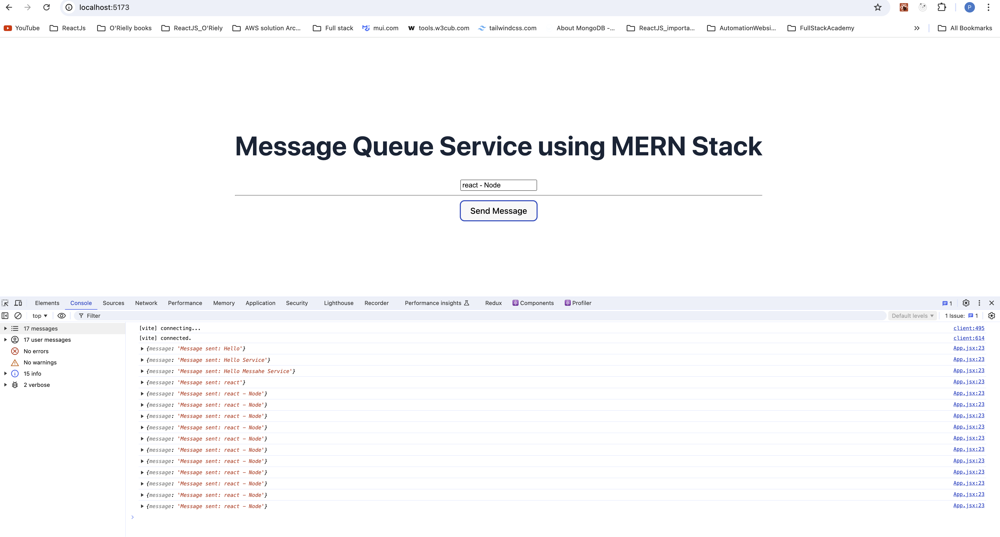
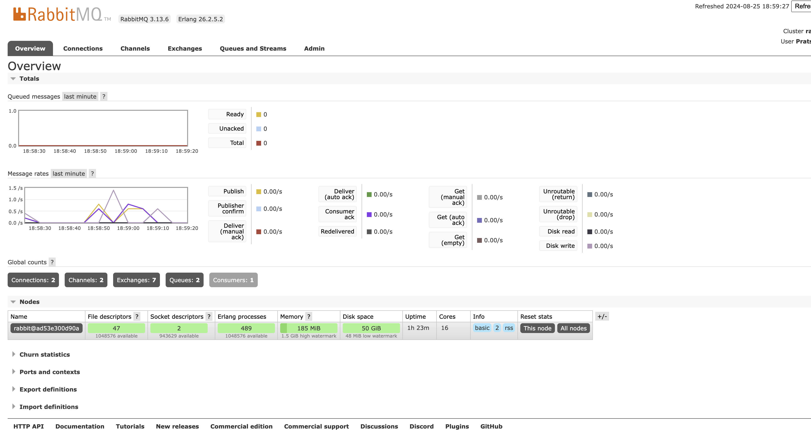
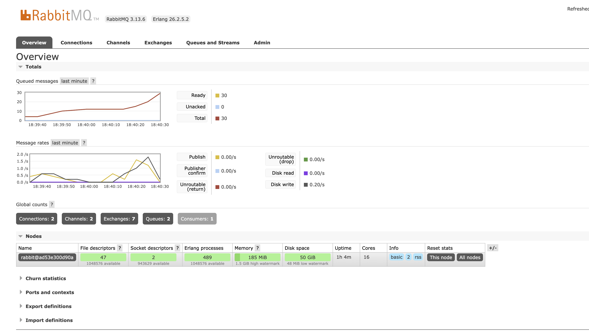
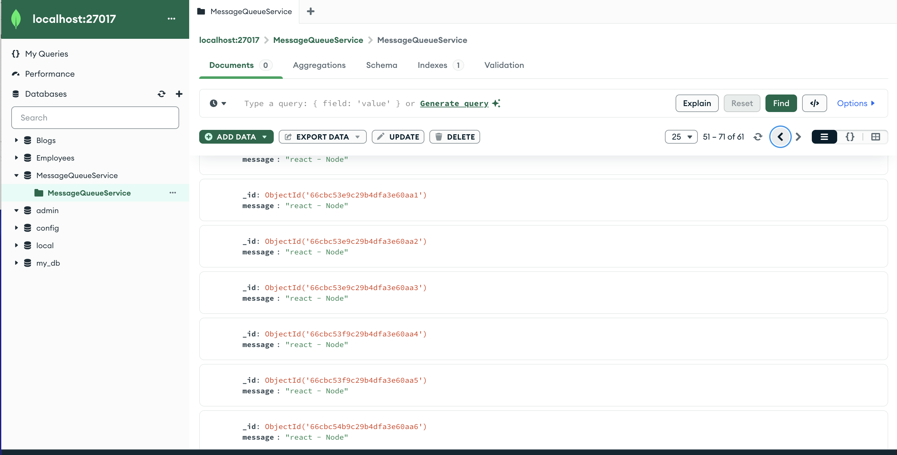

# MessageQueueService

Step 1:  Install RabbitMQ
    - using Docker install RabbitMQ
    ``` 
    docker run -d --name rabbitmq -p 5672:5672 -p 15672:15672 rabbitmq:3-management
    ```
    -  This will start RabbitMQ, and the management console will be accessible at http://localhost:15672
    - Access RabbitMQ managment console
    - create queue





